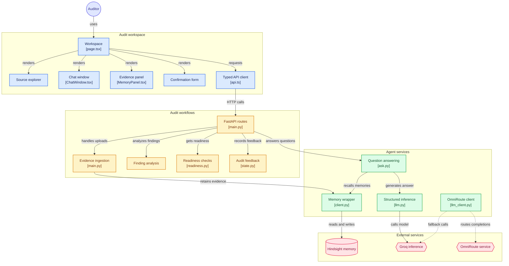

# Audit Agent

An AI-powered compliance and audit-assurance assistant designed to help auditors, compliance teams, and engineers seamlessly manage, query, and verify audit records, policies, and findings. Audit Agent uses advanced memory retrieval and vector search to act as an intelligent co-pilot for reviewing evidence, tracking exceptions, and comparing past audit cases.

---

## System Workflow



---

## Key Features

| Feature | Description |
| :--- | :--- |
| **Audit Memory & Recall** | Automatically retrieves past findings, management responses, and historical context to intelligently evaluate new audit evidence and avoid redundant work. |
| **Source Explorer** | Upload, browse, and manage policies, access reviews, control definitions, and remediation documents in a centralized UI. |
| **Intelligent Document Indexing** | Integrates seamlessly with the **Vectorize Hindsight API** for powerful real-time document indexing, chunking, and semantic retrieval. |
| **Conversational Interface** | Ask complex, multi-hop questions like *"Which controls had testing exceptions?"* or *"Show me the relationship between SOC 2 requirements and our current policies."* |
| **Case Comparison & Root Cause Analysis** | Leverages LLMs (via Groq) to cross-reference evidence, perform deterministic checks, and highlight recurrence candidates. |

---

## Architecture & Tech Stack

The project is split into two main components: a **Next.js** frontend and a **FastAPI** backend.

| Component | Technology | Description |
| :--- | :--- | :--- |
| **Frontend** | Next.js (React), TypeScript, Tailwind CSS | Real-time chat UI, resizable side panels for source exploration and memory hits, drag-and-drop file uploads, and deterministic Markdown rendering. |
| **Backend** | FastAPI (Python 3.11+), `uv` | API routing, file processing, memory retention, and interactions with external inference services. |
| **AI / LLM** | Groq, OmniRoute | Fast, structured JSON generation and Pydantic v2 validation via fallback chains. |
| **Vector Engine** | Hindsight API | `hindsight-client` by Vectorize for semantic search and operational memory. |

---

## Getting Started

### Prerequisites

| Prerequisite | Minimum Version | Notes |
| :--- | :--- | :--- |
| **Node.js** | v18+ | Required for the Next.js frontend. |
| **Python** | 3.11+ | Required for the FastAPI backend. |
| **Package Manager** | `uv` | Fast Python package manager. |
| **API Keys** | - | **Hindsight API Key** (Vectorize) and **Groq API Key**. |

### 1. Backend Setup

The backend handles API routing, file processing, and interactions with Hindsight and Groq.

```bash
cd backend

# Install dependencies using uv
uv sync

# Start the FastAPI server (runs on http://localhost:8000)
uv run uvicorn main:app --reload --port 8000
```

**Backend Environment Variables:**
Create a `.env` file inside the `backend/` directory (these should NEVER be committed to Git):
```env
HINDSIGHT_API_KEY=your_hindsight_api_key
GROQ_API_KEY=your_groq_api_key
```

### 2. Frontend Setup

The frontend provides the interactive Audit Memory workspace.

```bash
cd frontend

# Install dependencies
npm install
# or if using yarn/pnpm: yarn install

# Start the development server (runs on http://localhost:3000)
npm run dev
```

**Frontend Environment Variables:**
Create a `.env.local` file inside the `frontend/` directory:
```env
NEXT_PUBLIC_API_URL=http://localhost:8000
NEXT_PUBLIC_SOURCE_UPLOAD_PATH=/upload
```

---

## Usage Guide

| Step | Action | Description |
| :--- | :--- | :--- |
| **1. Launch** | Open Workspace | Navigate to `http://localhost:3000` in your browser. |
| **2. Add Evidence** | Upload Files | Use the **Source Explorer** (left panel) to drag and drop audit evidence (PDFs, TXT, JSON, MD). Files are immediately indexed into your Hindsight corpus. |
| **3. Ask Questions** | Chat Interface | Ask compliance-related queries in the central chat panel. Ensure **Agent Memory** is toggled ON to reference historical cases. |
| **4. Review Context** | Inspect Memory Hits | The right panel displays the precise references, exact document snippets, and historical findings the agent used to formulate its answer. |
| **5. Confirm Findings** | Evaluate Comparisons | Review LLM-generated comparisons and confirm whether an issue is a recurrence of a past finding. |

---

## API Reference (Backend)

| Endpoint | Method | Description |
| :--- | :--- | :--- |
| `/sources` | `GET` | Fetches the combined list of locally seeded documents and live documents indexed in the Hindsight online corpus. |
| `/upload` | `POST` | Uploads a document (TXT, MD, PDF, etc.) to the local index and forwards it to Hindsight for vector embedding. |
| `/api/ask` | `POST` | The main conversational endpoint. Submits the user's question along with context and memory flags to the LLM. |

---

## Development Guidelines

- **Package Management**: Always use `uv` for managing Python dependencies to ensure speed and determinism.
- **Type Safety**: The frontend strictly uses TypeScript. Avoid `any` types; prefer strict interfaces (e.g., `SourceRecord`, `Analysis`, `MemoryHit`).
- **Secrets Management**: Never commit API keys. Use `.env` files and keep the `backend/state/` directory gitignored.
- **Business Logic**: Never use `date.today()` or `datetime.now()` for audit constraints. Rely on `AS_OF_DATE` configurations for reproducible deterministic auditing.

---

*Built for advanced agentic auditing.*
