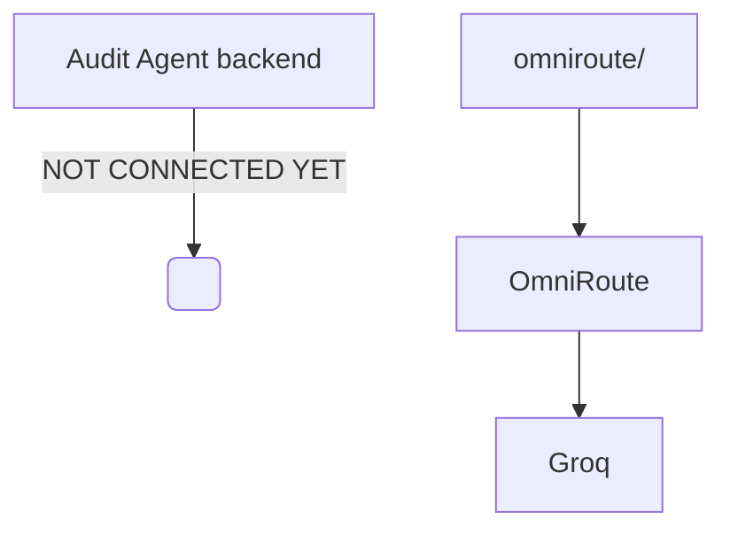

# OmniRoute LLM Integration

This is a standalone top-level module responsible for integrating the OmniRoute OpenAI-compatible API gateway.

## Architecture

This module is intentionally **NOT** connected to the `backend/` yet. It serves as an isolated proving ground for the LLM routing capabilities.



## Environment Variables

Copy `.env.example` to `.env` (or run it using the root `audit-agent/.env` file) and configure:
- `OMNIROUTE_BASE_URL` (default: http://127.0.0.1:20128/v1)
- `OMNIROUTE_API_KEY`
- `OMNIROUTE_MODEL` (default: groq/openai/gpt-oss-120b)

## How to run Unit Tests

From the `omniroute/` directory:
```bash
uv run pytest tests/test_llm_client.py
```

## How to run Live Integration Test

From the `omniroute/` directory:
```bash
uv run python scripts/integration_omniroute.py
```
